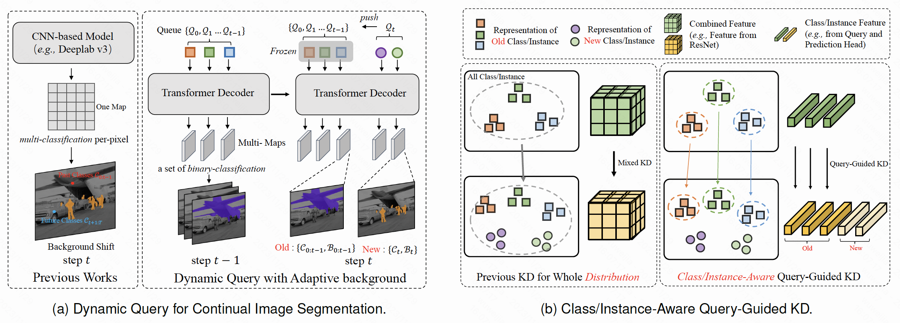

# CisDQ

### <div align="center"> Continual Learning for Image Segmentation with Dynamic Query <div> 


## :notes: **Updates**


- [x] Nov. 29, 2023. CisDQ is accepted by TCSVT
- [x] Nov. 29, 2023. Rep initialization.


---

## 🐱 Abstract
<font color="red">CisDQ</font> Abstract—Image segmentation based on continual learning
exhibits a critical drop of performance, mainly due to catastrophic
forgetting and background shift, as they are required to
incorporate new classes continually. In this paper, we propose
a simple, yet effective Continual Image Segmentation method
with incremental Dynamic Query (CISDQ), which decouples
the representation learning of both old and new knowledge
with lightweight query embedding. CISDQ mainly includes three
contributions: 1) We define dynamic queries with adaptive background
class to exploit past knowledge and learn future classes
naturally. 2) CISDQ proposes a class/instance-aware Query
Guided Knowledge Distillation strategy to overcome catastrophic
forgetting by capturing the inter-class diversity and intra-class
identity. 3) Apart from semantic segmentation, CISDQ introduce
the continual learning for instance segmentation in which
instance-wise labeling and supervision are considered. Extensive
experiments on three datasets for two tasks (i.e., continual
semantic and instance segmentation are conducted to demonstrate
that CISDQ achieves the state-of-the-art performance,
specifically, obtaining 4.4% and 2.9% mIoU improvements for
the ADE 100-10 (6 steps) setting and ADE 100-5 (11 steps) setting.

---




## 🔧 Dependencies and Installation
Please following [mask2former](https://github.com/facebookresearch/Mask2Former) for the installation.


## 💻 Training


### VOC
```bash 
sh ./configs/vocincremental-segmentation/10-1/train.sh
```

### ADE 20k - instance segmentation
```bash 
sh ./configs/ade20k/incremental-instance-segmentation/50-50/train.sh
```

### coco
```bash 
sh ./configs/coco/incremental-instance-segmentation/40-20/train.sh
```


## 💻 Inference


## 📖BibTeX

    
@article{he2023binarizing,
  title={Continual Learning for Image Segmentation with Dynamic Query},
  author={Weijia Wu, Yuzhong Zhao, Zhuang Li, Lianlei Shan, Hong Zhou, Mike Zheng Shou},
  journal={IEEE Transactions on Circuits and Systems for Video Technology},
  year={2023},
  publisher={IEEE}
}
